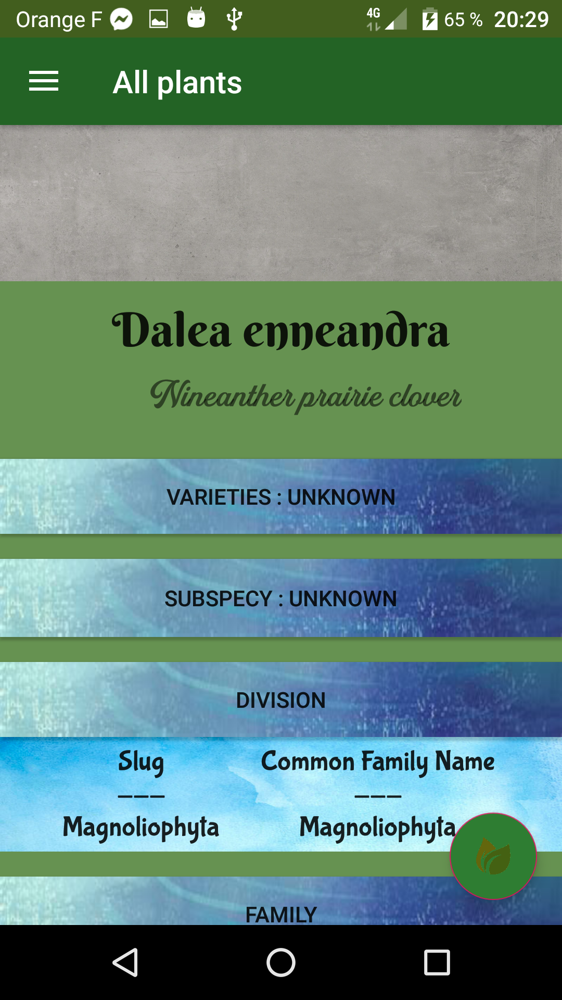

# Wooden-Sundays
Présentation de l'application
 

 

Wooden Sundays est un application recensant l'ensemble des plantes inscrites dans la base de donnée Trefle.io ainsi que les catégories de classement des plantes scientifiques et les normes associées.

L'application
 
Écran d'accueil

Vous acceuille et vous permet d'accéder à la Navigation Bar et les autres Fragments.

 
Listes des plantes
 
Ici nous trouverons la liste de toutes les plantes disponibles dans la base de donnée Trefle.io
 
L'API ne permet pas le tri des plantes via la requête Query et il est impossible de traiter les 389014 plantes dans un tableau afinde les trier. Cela rendrait l'application beaucoup trop lente.
La récupération et l'affichage des plantes est donc... aléatoire.

 
Si nous cliquons sur l'un des éléments de la liste nous accédons à ses détails.
L'API n'étant pas complète, beaucoup de données manquent à l'appel. Certaines plantes seront très fournies en détail et photos tandis que d'autres n'aurions rien de cela.

 

 
Liste de Genre
 

Nous allons trouver ici, dans la même disposition que la liste de plantes, l'ensemble des genres listés par Trefle.

Il est également possible d'accéder à leur disposition dans l'abre strucutrel des plantes, des Royaumes au Familles.

 
Liste de Familles
 
La même chose, mais avec les familles.

Bonne utilisation !
